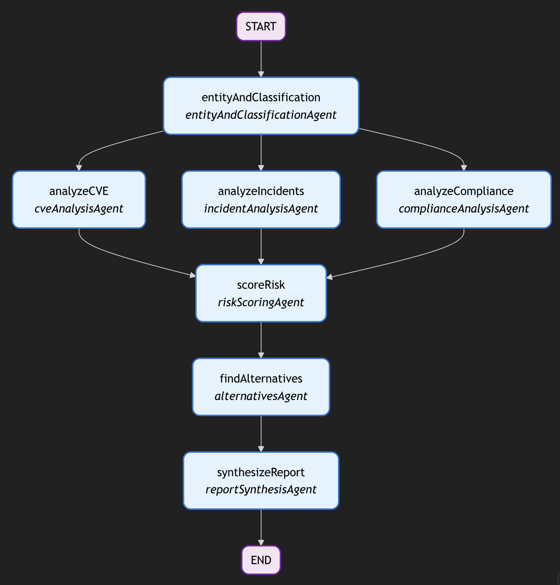

# Reputation Recon

## Introduction

Reputation Recon is a solution application developed for the Junction 2025 hackathon, specifically addressing Withsecure's Reputation Recon challenge. This application provides comprehensive security and reputation assessment for software products through an intelligent multi-agent workflow system.

## Demo

**Video Demonstration:** [Watch the demo on Google Drive](https://drive.google.com/file/d/1hRxlhVysSAICNo671eyXtufCd7nTfUlI/view?usp=sharing)

> Note: For the best viewing experience, the video can be embedded on platforms that support HTML iframes. On GitHub, please use the link above to view the demonstration.

## About the App

The Assessment agent is built using modern web technologies and AI frameworks to deliver automated security assessments. The application leverages a workflow based multi agent architecture to analyze software products across multiple security dimensions. The solution doesn't replace any role however, takes away a lot of manual research step from the decision makers.

### Tech Stack

- **Framework**: Next.js 16
- **Language**: TypeScript
- **AI/ML**:
  - LangChain & LangGraph for agent orchestration
  - Anthropic Claude
  - Tavily Search for web search capabilities
- **Styling**: Tailwind CSS 4
- **PDF Generation**: Puppeteer
- **Validation**: Zod
- **UI Components**: Custom components with Lucide React icons

## Workflow Architecture

The application uses a multi-agent workflow system built with LangGraph to orchestrate parallel and sequential analysis tasks. The reason behind this architecture over full autonomous agent workflow is to maintain consistency and reliability in terms of assessment. Thus, even though some of the individual agents are built on ReACT, we still follow a structured process which imitates how a real world process would look like.



### Agents

The workflow consists of seven specialized agents, each responsible for a specific aspect of the security assessment:

#### 1. Entity and Classification Agent

- **Purpose**: Performs entity resolution and software classification
- **Responsibilities**:
  - Identifies official product name and vendor information
  - Researches company background, headquarters, and founding year
  - Classifies software into categories (File Sharing/Storage, GenAI Tool/LLM Platform, SaaS CRM, etc.)
  - Determines deployment model and target users
  - Extracts key features and capabilities
- **Tools**: Web Search

#### 2. CVE Analysis Agent

- **Purpose**: Analyzes Common Vulnerabilities and Exposures history
- **Responsibilities**:
  - Counts total CVEs in the last 2 years
  - Categorizes vulnerabilities by severity (Critical, High, Medium, Low)
  - Identifies recent critical vulnerabilities (last 6 months)
  - Calculates average patch response time
  - Analyzes CVE trends (improving, stable, declining)
  - Documents notable incidents related to CVEs
- **Tools**: NIST CVE Search

#### 3. Incident Analysis Agent

- **Purpose**: Researches security incidents and abuse signals
- **Responsibilities**:
  - Identifies data breaches (last 3 years)
  - Documents security incidents with dates and severity
  - Tracks abuse/misuse in the wild
  - Identifies ransomware/malware associations
  - Rates vendor's security track record (1-10)
  - Evaluates public disclosures and transparency (1-10)
- **Tools**: Web Search

#### 4. Compliance Analysis Agent

- **Purpose**: Analyzes compliance posture and data handling practices
- **Responsibilities**:
  - Identifies certifications (SOC 2, ISO 27001, GDPR, HIPAA, etc.)
  - Evaluates data handling practices
  - Documents data residency options
  - Assesses privacy policy quality (1-10)
  - Reviews third-party audits
  - Evaluates compliance documentation availability
  - Analyzes admin controls and permissions model
  - Reviews data encryption (at rest and in transit)
  - Calculates overall compliance score (1-10)
- **Tools**: Web Search

#### 5. Risk Scoring Agent

- **Purpose**: Calculates comprehensive risk score based on all gathered data
- **Responsibilities**:
  - Computes trust score (0-100, where 100 is most trustworthy)
  - Determines confidence level (Low, Medium, High)
  - Identifies key risk factors and positive factors
  - Provides recommendation (Approve, Approve with conditions, Reject)
  - Determines risk level (Low, Medium, High, Critical)
  - Provides detailed rationale for scoring

#### 6. Alternatives Agent

- **Purpose**: Suggests safer alternatives to the assessed software
- **Responsibilities**:
  - Identifies 1-2 safer alternatives that serve similar use cases
  - Evaluates alternatives based on better security posture
  - Ensures alternatives are appropriate for enterprise use
  - Provides brief rationale for each alternative

#### 7. Report Synthesis Agent

- **Purpose**: Synthesizes all gathered intelligence into an executive-ready brief
- **Responsibilities**:
  - Creates executive summary (2-3 sentences)
  - Compiles product overview
  - Generates security posture summary with precise citations
  - Lists key findings (risks and strengths)
  - Provides trust score with rationale
  - Includes recommendation
  - Documents alternative options
  - Aggregates all sources from previous analyses

### Tools

The agents utilize specialized tools to gather real-time information:

#### Web Search Tool

- **Implementation**: Tavily Search API
- **Purpose**: Performs comprehensive web searches to gather current information about software products, vendors, security incidents, and compliance documentation
- **Usage**: Used by Entity and Classification, Incident Analysis, and Compliance Analysis agents

#### NIST CVE Search Tool

- **Implementation**: NIST National Vulnerability Database (NVD) API
- **Purpose**: Searches the NIST National Vulnerability Database for Common Vulnerabilities and Exposures related to software products or vendors
- **Features**:
  - Returns CVE IDs, descriptions, CVSS scores, severity levels, and publication dates
  - Supports keyword-based searches for products and vendors
  - Provides comprehensive vulnerability data including CVSS v2.0, v3.0, v3.1, and v4.0 metrics
- **Usage**: Used by CVE Analysis agent

## Directory Structure

```
rep_recon/
├── app/                          # Next.js app directory
│   ├── api/                      # API routes
│   │   ├── chat/                 # Chat API endpoint
│   │   │   └── route.ts
│   │   └── report/               # Report generation endpoints
│   │       └── pdf/
│   │           └── route.ts      # PDF generation endpoint
│   ├── assessment-agent/         # Assessment agent page
│   │   └── page.tsx
│   ├── reports/                  # Reports page
│   │   └── page.tsx
│   ├── globals.css               # Global styles
│   ├── layout.tsx                # Root layout
│   └── page.tsx                  # Home page
├── components/                   # React components
│   ├── ui/                       # UI components
│   │   ├── button.tsx
│   │   ├── input.tsx
│   │   └── textarea.tsx
│   ├── chat-interface.tsx        # Chat interface component
│   ├── display-report.tsx        # Report display component
│   ├── main-content.tsx        # Main content component
│   ├── sidebar.tsx               # Sidebar component
│   ├── theme-provider.tsx        # Theme provider
│   └── theme-toggle.tsx          # Theme toggle component
├── lib/                          # Core library code
│   ├── agents/                   # Agent implementations
│   │   ├── entity-and-classification.ts
│   │   ├── cve-analysis.ts
│   │   ├── incident-analysis.ts
│   │   ├── compliance-analysis.ts
│   │   ├── risk-scoring.ts
│   │   ├── alternatives.ts
│   │   ├── report-synthesis.ts
│   │   └── index.ts
│   ├── models/                   # LLM model configuration
│   │   └── llm.ts
│   ├── schemas/                  # Zod validation schemas
│   │   ├── entity-classification.ts
│   │   ├── cve-analysis.ts
│   │   ├── incident-analysis.ts
│   │   ├── compliance-analysis.ts
│   │   ├── risk-scoring.ts
│   │   ├── alternatives.ts
│   │   └── report-synthesis.ts
│   ├── tools/                    # Agent tools
│   │   ├── web-search.ts         # Tavily web search tool
│   │   ├── nist-cve-search.ts    # NIST CVE search tool
│   │   └── index.ts
│   ├── types/                    # TypeScript type definitions
│   │   └── assessment-state.ts
│   ├── utils/                    # Utility functions
│   │   ├── json-parser.ts
│   │   └── utils.ts
│   └── workflow/                 # Workflow orchestration
│       └── assessment-workflow.ts
├── public/                       # Static assets
│   ├── withsecure_logo.webp
│   └── [other assets]
├── workflow_graph.png            # Workflow visualization
├── components.json               # Component configuration
├── next.config.ts                # Next.js configuration
├── package.json                  # Dependencies
├── tailwind.config.ts            # Tailwind CSS configuration
├── tsconfig.json                 # TypeScript configuration
└── README.md                     # This file
```

## Getting Started

### Prerequisites

- Node.js 20 or higher
- npm, yarn, pnpm, or bun

### Installation

```bash
npm install
```

### Environment Variables

Create a `.env.local` file in the root directory with the following variables:

```
ANTHROPIC_API_KEY=your_anthropic_api_key
TAVILY_API_KEY=your_tavily_api_key
```

### Development

```bash
npm run dev
```

Open [http://localhost:3000](http://localhost:3000) in your browser.

### Build

```bash
npm run build
```

### Start Production Server

```bash
npm start
```

This project was developed for Junction 2025 hackathon's Reputation Recon challenge from WithSecure.
